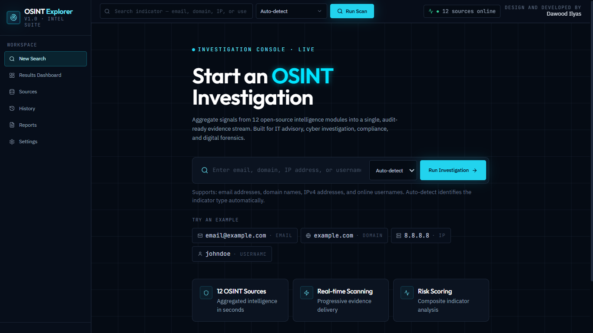
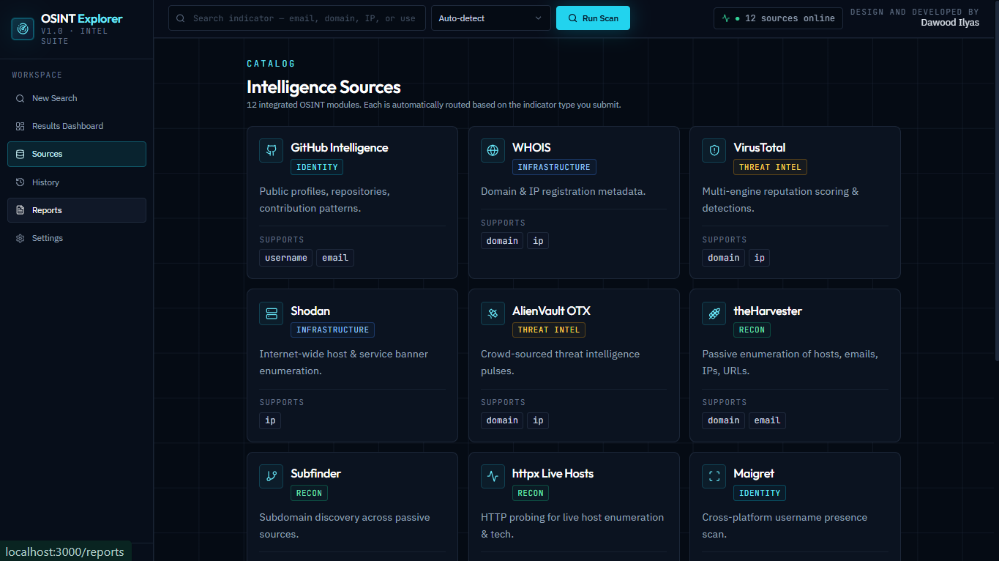
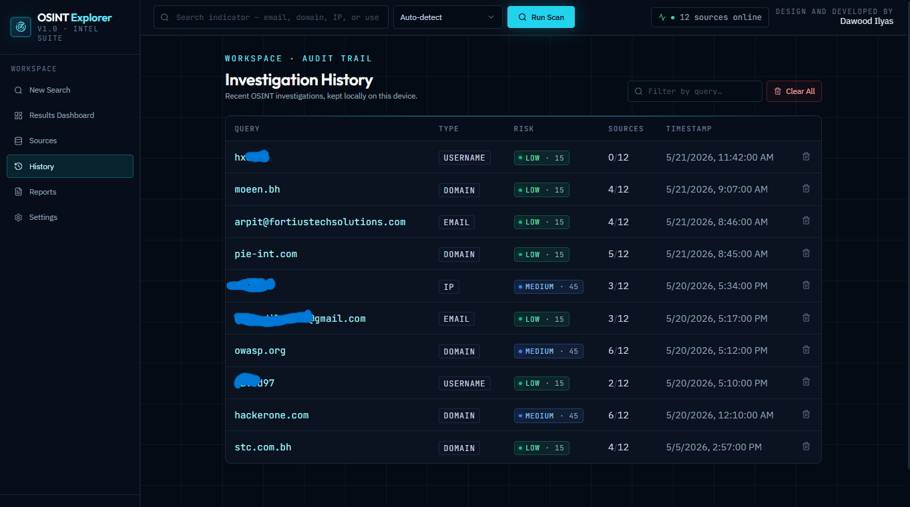
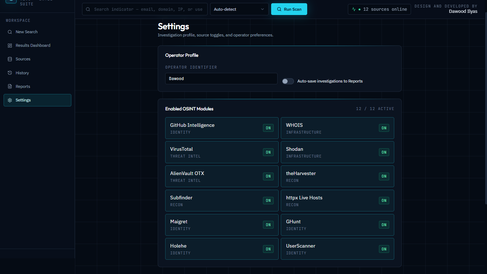
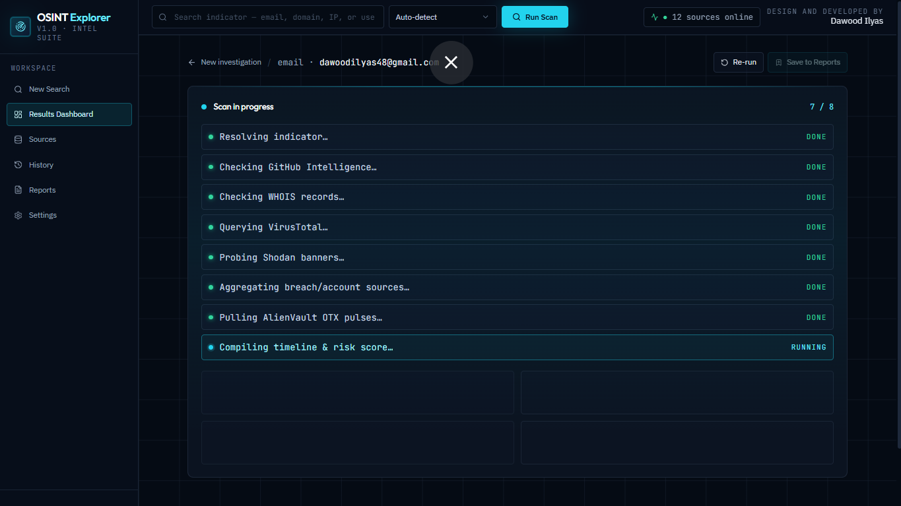
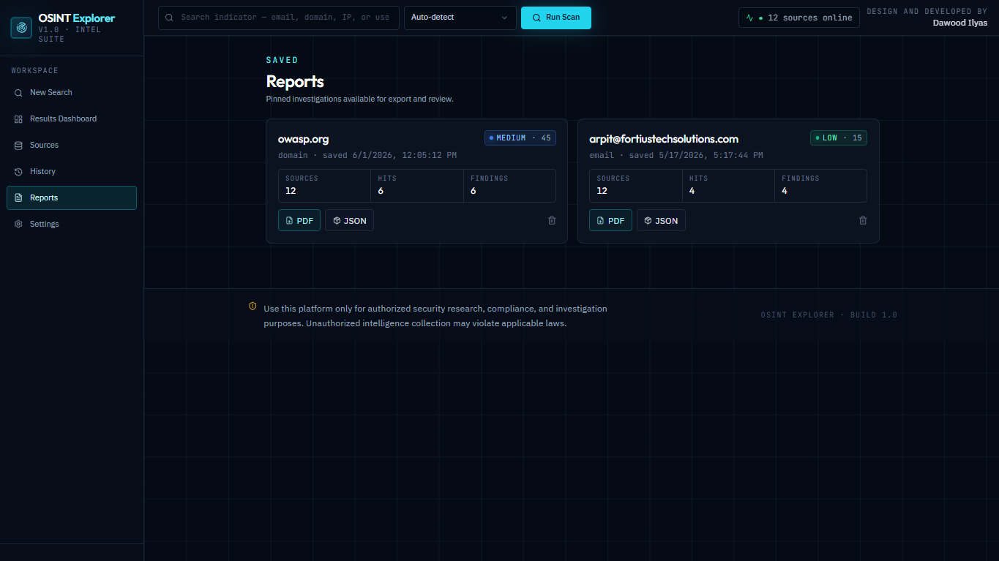

# 🕵️‍♂️ OSINT Explorer

**OSINT Explorer** is a cybersecurity focused investigation platform built to centralize public intelligence gathering into one clean, modern, and easy-to-use web application.

The platform allows users to search different indicators such as:

* 🌐 Domains
* 🖥️ IP addresses
* 📧 Email addresses
* 👤 Usernames

It then displays the collected intelligence in a structured dashboard with **risk levels, key findings, investigation summaries, and technical evidence**.

Instead of manually checking multiple OSINT tools, APIs, and terminal outputs one by one, OSINT Explorer brings everything together into one workflow.

---


---

## 📌 Project Overview

OSINT Explorer is designed as a practical cybersecurity product that combines:

* 🧠 Cybersecurity thinking
* 💻 Full-stack development
* 🔗 REST API integration
* 🐉 Kali Linux tooling
* 🧪 Threat intelligence sources
* ⚙️ Automation
* 📊 Clean dashboard-based result presentation
* 🤖 AI-assisted development workflow

The goal of this project is to make OSINT investigations faster, cleaner, and easier to understand.

---

## ❓ Why I Built This

Cybersecurity investigations often require checking many different sources separately.

For example, an analyst may need to check:

* Domain information
* Subdomains
* Public IP data
* Open ports
* Email exposure
* Username presence
* Threat intelligence signals
* Technology fingerprints

Doing all of this manually can be slow, repetitive, and scattered across many tools.

So I built OSINT Explorer to solve that problem.


## 📸 Screenshots

### ⚠️ **Sensitive Information Notice**

### **Due to the sensitive nature of OSINT queries and investigation results, only selected screenshots have been included. Any sensitive query details, personal information, or private investigation data have been intentionally excluded from the public repository.**

### 🏠 Home


### 📡 Sources


### 🕘 History


### ⚙️ Settings


### 🔎 Search Options


### 🧪 Query



### 🌐 Domain Search


### 📄 Reports


---


### ✅ OSINT Explorer helps by:

* Centralizing multiple OSINT checks into one dashboard
* Reducing manual tool usage
* Turning raw API and CLI outputs into cleaner results
* Helping users understand digital exposure faster
* Supporting faster investigation decisions
* Combining software engineering with cybersecurity workflows

---

## 🧩 What the Application Does

The user enters a domain, IP address, email, or username.

The system then:

1. Detects the type of input
2. Selects the correct OSINT modules
3. Runs API-based lookups and/or Kali Linux tools
4. Collects raw results
5. Cleans and normalizes the output
6. Sends structured JSON back to the frontend
7. Displays everything in a clean investigation dashboard

---

## ✨ Key Features

* 🔍 Search by domain, IP address, email, or username
* 🧠 Automatic query type detection
* 🧱 Modular backend architecture
* 🔗 External API integration
* 🐉 Kali Linux tool integration through SSH
* 🧬 Flask backend for routing and processing
* 🔐 Paramiko SSH connection from host machine to Kali VM
* ⚛️ React frontend dashboard
* 📦 Normalized JSON output
* 📊 Clean module-based result cards
* ⚠️ Risk level display
* 📝 Key findings section
* 📌 Investigation summary
* 🧹 Raw CLI output cleaning and parsing
* 🛠️ API + command-line tool combination
* 🎯 Designed for cybersecurity investigation workflows

---

## 🧠 Tech Stack

### 🎨 Frontend

* React
* JavaScript
* HTML
* CSS
* Component-based UI
* Dashboard-style result display

### ⚙️ Backend

* Python
* Flask
* REST API routes
* Paramiko SSH library
* JSON response formatting
* Regex-based parsing
* Modular Python service files

### 🐉 Kali Linux / Security Tools

* Kali Linux VM
* SSH connection from Flask backend to Kali VM
* theHarvester
* Subfinder
* httpx toolkit
* Holehe
* Maigret
* WHOIS-related lookups
* OSINT/security tools depending on the selected module

### 🌍 External APIs / Intelligence Sources

* Shodan
* VirusTotal
* AlienVault OTX
* Censys
* WHOIS sources
* Public intelligence APIs where supported

### 🧰 Development Workflow

* Git
* GitHub
* AI-assisted development
* Manual debugging
* API testing
* Local virtual environment
* VM-based cybersecurity lab setup

---

## 🤖 AI-Assisted / Vibe-Coded Development

Parts of OSINT Explorer were developed using an **AI-assisted development workflow**, also known as **vibe coding**.

The frontend was heavily vibe-coded to speed up the design and development of:

* Dashboard layout
* Result cards
* UI structure
* Component styling
* User experience improvements
* Cleaner visual presentation

Some backend components were also AI-assisted, especially for:

* Structuring Python modules
* Improving code organization
* Debugging errors
* Formatting JSON responses
* Writing parsers
* Improving documentation
* Speeding up repetitive coding tasks

However, this project was not simply copied and pasted without understanding.

The system was manually tested, modified, debugged, and adapted to work with the actual OSINT workflow, Kali VM setup, API responses, SSH connection, and project requirements.

### 🧠 My development approach:

* Use AI tools to prototype faster
* Understand the generated code
* Modify it based on real project needs
* Debug actual errors
* Connect real systems together
* Test the final output
* Improve the project based on results

### Tools used during the workflow:

* ChatGPT
* Claude
* Cursor
* Replit
* Lovable
* AI-assisted debugging and documentation support

This reflects how modern builders work: using AI as an accelerator while still understanding, testing, and owning the final product.

---

## 🏗️ System Architecture

OSINT Explorer uses a multi-layer architecture:

```text
User
 |
 | enters domain / IP / email / username
 v
React Frontend
 |
 | sends request to Flask backend
 v
Flask Backend
 |
 | detects query type
 | selects correct OSINT modules
 | calls APIs and/or connects to Kali VM
 v
API Modules + Kali Tool Modules
 |
 | return raw JSON or CLI output
 v
Parser / Normalizer
 |
 | cleans and structures the data
 v
Flask Response
 |
 | sends clean JSON to frontend
 v
React Dashboard
 |
 | displays risk level, key findings, summaries, and module results
```

---

## 🐉 How Kali VM Is Connected

One of the strongest technical parts of this project is the connection between the Flask backend and a Kali Linux virtual machine.

Some OSINT tools are installed and executed inside Kali Linux because Kali is commonly used for cybersecurity testing, reconnaissance, and security research.

Instead of manually opening Kali and typing commands one by one, OSINT Explorer connects to Kali through SSH and runs selected tools automatically.

### Kali connection flow:

```text
Windows Host Machine
 |
 | runs Flask backend
 |
 | uses Paramiko SSH
 v
Kali Linux Virtual Machine
 |
 | receives command
 | runs OSINT tool
 | returns terminal output
 v
Flask Backend
 |
 | cleans and parses output
 | converts result into structured JSON
 v
React Frontend
 |
 | displays result in dashboard
```

---

## 🔐 How Flask, Paramiko, and SSH Work Together

The Flask backend acts as the control center of the application.

When the user enters a query, Flask decides what type of input it is.

For example:

* 🌐 If the input is a domain, domain OSINT modules are triggered.
* 🖥️ If the input is an IP address, IP intelligence modules are triggered.
* 📧 If the input is an email address, email lookup modules are triggered.
* 👤 If the input is a username, username search modules are triggered.

For tools that run inside Kali Linux, Flask uses **Paramiko**.

Paramiko is a Python SSH library that allows the Flask backend to connect to the Kali VM and run terminal commands remotely.

### Process:

1. User enters a search query in the React frontend.
2. React sends the query to the Flask backend.
3. Flask identifies the query type.
4. Flask selects the relevant module.
5. If the module requires Kali, Flask uses Paramiko to open an SSH connection.
6. Paramiko sends the command to the Kali VM.
7. Kali runs the selected OSINT tool.
8. Kali returns terminal output.
9. Flask receives the raw CLI output.
10. The backend parser removes unnecessary formatting.
11. Flask converts the result into clean JSON.
12. React displays the result in a readable dashboard.

This allows the application to combine **web development, cybersecurity tooling, automation, APIs, and Linux-based security tools** in one product.

---

## 🌟 Why This Project Stands Out

OSINT Explorer is not just a simple website.

It combines multiple technical areas into one working system:

* Full-stack web development
* Cybersecurity investigation workflows
* Kali Linux automation
* SSH-based remote command execution
* Threat intelligence APIs
* API and CLI result normalization
* Dashboard-based user experience
* AI-assisted rapid development
* Risk-focused result presentation

From a student builder perspective, this project is powerful because it turns traditionally manual cybersecurity tasks into a more automated and user-friendly product.

Instead of only showing raw terminal output, OSINT Explorer makes the results easier to understand through:

* Clean UI cards
* Risk levels
* Key findings
* Summary sections
* Structured JSON data
* Organized modules
* Search-based routing

This makes the project more than a collection of tools. It becomes a practical cybersecurity investigation platform.

---

## 🔎 Supported Query Types

### 🌐 Domain Search

Domain search can support modules such as:

* WHOIS lookup
* Subdomain discovery
* HTTP probing
* Technology detection
* Threat intelligence checks
* Public exposure analysis

Example input:

```text
example.com
```

---

### 🖥️ IP Address Search

IP search can support modules such as:

* Shodan IP lookup
* Organization information
* Open port information from supported sources
* Country or hosting information
* Service and banner information where available
* Threat intelligence checks

Example input:

```text
8.8.8.8
```

---

### 📧 Email Search

Email search can support modules such as:

* Holehe lookup
* Public account exposure checks
* Email-related OSINT signals
* Platform registration signals where supported

Example input:

```text
test@example.com
```

---

### 👤 Username Search

Username search can support modules such as:

* Maigret username scan
* Public platform discovery
* Social/profile presence checks
* Username exposure mapping

Example input:

```text
exampleuser
```

---

## 📊 Screenshots

Add screenshots inside a folder called:

```text
screenshots/
```

Recommended screenshot file names:

```text
screenshots/
  01-home-page.png
  02-search-input.png
  03-domain-results.png
  04-ip-results.png
  05-email-results.png
  06-username-results.png
  07-risk-summary.png
  08-dashboard-overview.png
```


## ⚙️ How It Works Internally

The project is built around modular OSINT modules.

Each module is responsible for a specific type of intelligence gathering.

Example:

* Shodan module handles IP intelligence
* Holehe module handles email platform checks
* Maigret module handles username searches
* Domain modules handle subdomain and WHOIS-related checks
* API modules communicate with external services
* Kali modules run CLI tools through SSH

The backend collects the results from different modules and returns a unified response to the frontend.

---

## 📦 Output Normalization

One of the main challenges in this project is that different tools return data in different formats.

For example:

* APIs usually return structured JSON
* Kali tools usually return raw terminal output
* Some tools return plain text
* Some tools return tables
* Some tools include extra formatting or ANSI characters

OSINT Explorer solves this by cleaning and normalizing the output.

The backend converts different result types into a more consistent structure so the frontend can display them properly.

This makes the dashboard easier to read and avoids showing messy raw outputs directly to the user.

---

## 🧪 Example Investigation Flow

Example: user searches an IP address.

```text
Input: 8.8.8.8
```

Flow:

```text
Frontend receives input
        |
        v
Backend detects IP address
        |
        v
IP-related modules are triggered
        |
        v
Shodan / threat intelligence modules collect data
        |
        v
Results are cleaned and structured
        |
        v
Frontend displays open ports, organization, services, and risk summary
```

---

## 🛡️ Cybersecurity Importance

OSINT Explorer is useful because public information can reveal a lot about a target’s digital footprint.

For example:

* Exposed subdomains may reveal forgotten systems
* Open ports may show active services
* Public emails may reveal employee or account exposure
* Usernames may reveal public accounts across platforms
* Domain records may reveal infrastructure details
* Threat intelligence sources may show suspicious indicators

This type of information can help security teams understand exposure before attackers take advantage of it.

The project demonstrates how cybersecurity tools can be turned into a product-style platform that is easier to use, explain, and scale.

---

## 🚧 Challenges Faced

Some of the main challenges during development included:

* Connecting Flask on the host machine to Kali Linux VM
* Running Kali tools remotely through SSH
* Handling different output formats from different tools
* Cleaning messy CLI outputs
* Managing API errors and missing API keys
* Normalizing results for frontend display
* Making the UI readable instead of overwhelming
* Routing different query types to the correct modules
* Debugging backend/frontend integration issues
* Making technical security results understandable to users

---

## ✅ What I Learned

Through this project, I improved my understanding of:

* Full-stack application development
* Flask backend architecture
* React dashboard development
* REST API integration
* Kali Linux tool usage
* SSH automation with Paramiko
* OSINT investigation workflows
* Threat intelligence sources
* JSON formatting and parsing
* Error handling
* GitHub documentation
* AI-assisted software development
* Building practical cybersecurity products

---

## 🔮 Future Improvements

Planned improvements include:

* 🔐 User authentication
* 📄 PDF report export
* 🧠 AI-generated investigation summaries
* 📁 Case management system
* 📊 Historical search tracking
* 🧪 More OSINT modules
* 🧬 Better risk scoring engine
* 🛡️ Organization-level monitoring
* 🌍 Live deployment
* 📌 Saved investigations
* 📥 Exportable evidence reports
* 🔔 Alerts for risky findings
* 🧾 Better logging and audit trail

---

## 📁 Recommended Project Structure

```text
osint-explorer/
│
├── backend/
│   ├── app.py
│   ├── modules/
│   ├── services/
│   ├── utils/
│   └── requirements.txt
│
├── frontend/
│   ├── src/
│   ├── public/
│   └── package.json
│
├── screenshots/
│   ├── 01-home-page.png
│   ├── 02-search-input.png
│   ├── 03-domain-results.png
│   ├── 04-ip-results.png
│   ├── 05-email-results.png
│   ├── 06-username-results.png
│   ├── 07-risk-summary.png
│   └── 08-dashboard-overview.png
│
├── README.md
└── .gitignore
```

---

## 🧑‍💻 About Me

I am **Dawood Ilyas**, a cybersecurity graduate from Bahrain Polytechnic with hands-on experience in full-stack development, cybersecurity tools, OSINT, REST APIs, databases, and secure application design.

I enjoy building practical products that combine cybersecurity and software engineering. OSINT Explorer reflects my interest in creating tools that are useful, technical, and product-focused.

---

## 📬 Contact

📧 Email: [dawoodilyas48@gmail.com](mailto:dawoodilyas48@gmail.com)
📱 Phone: +973 3508 1922
💻 GitHub: [Add your GitHub profile link]
🔗 LinkedIn: [Add your LinkedIn link]

---

## ⚠️ Disclaimer

This project is created for educational, cybersecurity learning, and defensive investigation purposes only.

OSINT Explorer should only be used on assets, domains, accounts, and systems that the user owns or is authorized to investigate.

The purpose of this project is to demonstrate cybersecurity awareness, OSINT workflows, full-stack development, API integration, and responsible security research.

---

## ⭐ Final Note

OSINT Explorer is my attempt to turn scattered cybersecurity investigation tools into a cleaner, faster, and more understandable product.

It represents my interest in building real systems, learning modern development workflows, using AI tools responsibly, and combining cybersecurity knowledge with product engineering.
